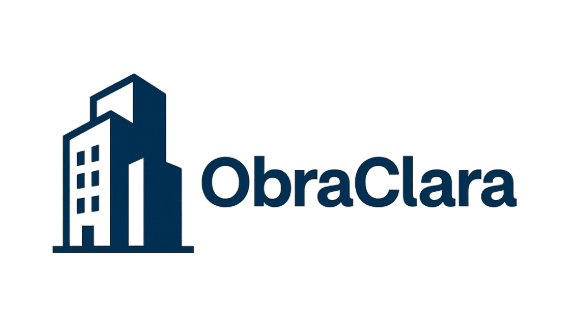

# 💡 IDEA-TON

## Contenido
- [Project Overview](#descripcion-del-projecto)
- [Equipo](#equipo)
- [Pitch Video](https://www.youtube.com/watch?v=1oGsoYutw24)
- [Pitch Deck](https://docs.google.com/presentation/d/1RyJv-ST3eSlvFXZlR7SOaVAwotoWy2GKRQ9r5jj8THw/edit?usp=sharing)
- [Milestone 2 Plan](MILESTONE-2-PLAN.md)
- [Technical Architecture](#technical-architecture)
- [Bonus Material](#bonus-material)
  - [Demo](#demo)
  - [User Feedback / Validation Evidence](#user-feedback)
  
## Descripcion del Projecto
ObraClara es una plataforma digital diseñada para modernizar la gestión de Órdenes de Servicio (OS) y Notas de Pedido (NP) en obras públicas.

Hoy estos procesos se realizan con WhatsApp, PDFs dispersos y libros físicos, lo que genera pérdida de trazabilidad, riesgos legales, demoras y una baja transparencia operativa.

La plataforma centraliza el registro, seguimiento y validación de documentos críticos de obra.

**Integra:**
- Digitalización automatizada de OS/NP mediante carga de fotos, PDF o texto.
- Trazabilidad inmutable en blockchain, registrando hashes para garantizar autenticidad y evitar manipulación.
- Alertas automáticas sobre plazos críticos y vencimientos.
- Búsquedas inteligentes con IA para encontrar historial, justificar demoras, auditar procesos o generar reportes en segundos.
- Dashboard unificado para jefes de obra y dueños de constructoras.

ObraClara reduce tiempos operativos, elimina pérdidas de documentación, fortalece la transparencia y genera evidencia legal confiable ante auditorías y organismos públicos.
Es una solución escalable para constructoras y municipios, alineada con estándares modernos de gestión pública y privada.

---
## Equipo

### Omar [ LinkedIn](https://www.linkedin.com/in/omar-s-moreno/)
**Co-fundador · Ingeniero de Software · Backend Developer**

_Experiencia en desarrollo de soluciones tecnológicas, automatización de  procesos, metodologías ágiles, experiencia de usuario y construcción de productos digitales._

- **Rol:** Diseño de la arquitectura técnica del MVP (integración de bases de datos, IA, notificaciones y blockchain).
- **Contribución Clave:** implementación técnica, validación de factibilidad y escalabilidad de la solución.

### Paulo [ LinkedIn](https://www.linkedin.com/in/paulino-cartagena-10155362/) 
**Co-fundador · Ingeniero Civil**

_Amplia trayectoria en el sector de construcción y obras públicas.
Conocimiento profundo de los dolores reales en la gestión de órdenes de servicio y notas._

- **Rol:** Aportar la visión del usuario final, validar procesos actuales y proponer mejoras realistas.
- **Contribución Clave:** garantizar que la solución resuelva problemas concretos del día a día en obras públicas y facilitar la adopción con empresas y municipios.

### Analia [ LinkedIn](https://www.linkedin.com/in/analia-cartagena/)
**Co-fundadora · Ingeniería de Software · MBA**

_Lidera la estrategia de innovación y transformación digital.
Experiencia en gestión de proyectos, metodologías ágiles, experiencia de usuario, construcción de productos digitales._

- **Rol:** Asegurar que la solución responda a necesidades reales de usuarios y esté alineada con los objetivos del concurso y de los municipios/constructoras.
- **Contribución Clave:** coordinación del equipo, diseño de encuestas, análisis de resultados y estrategia de implementación.

---
### Pitch Video
TODO!!
(https://youtu.be/1oGsoYutw24)
- [ ]  2-3 minute pitch video (uploaded and link provided)
    - Walkthrough of what you built + your pitch
    - Include: problem, solution, demo, market context, Milestone 2 overview
    - Upload to any platform (e.g., YouTube, Loom) and share the link
---
TODO!!
### [Pitch Deck](https://docs.google.com/presentation/d/1RyJv-ST3eSlvFXZlR7SOaVAwotoWy2GKRQ9r5jj8THw/edit?usp=sharing)
- [ ]  Pitch deck (URL)
    - Problem & solution
    - Market research & competitive analysis
    - Technical approach
    - Milestone 2 plan summary

---
## Technical Architecture

TODO!!!

---
## Bonus Material

### Demo

### User Feedback

### Bonus Material (to be Included in `README.md`)

- [ ]  Demo video showing prototype/concept (separate from pitch video)
- [ ]  User feedback or validation evidence (e.g. surveys, results from mini marketing campaign)
- [ ]  Marketing material or plan (e.g. social media links, online engagement with product)

### 💡 IDEA-TON TECH REQUIREMENTS

- Technical architecture document (detailed plan)
- Wireframes/mockups showing user flow
- See: [IDEA-T-ON TECHNICAL PLAN CHECKLIST](https://www.notion.so/IDEA-T-ON-TECHNICAL-PLAN-CHECKLIST-2a43e52aeb1580558beddf44eed73e73?pvs=21)

----
# IDEA-T-ON TECHNICAL PLAN CHECKLIST

## 🏗️ Technical Architecture

### System Diagram

*[Include ONE clear diagram showing how your components connect. Use Mermaid, Excalidraw, or draw on paper and photo it]*

E.g. mermaid :

`graph LR
    A[Component 1] --> B[Component 2]
    B --> C[Component 3]`

### Tech Stack

**Frontend:**

- Framework: [e.g., Next.js, React]
- Web3: [e.g., Polkadot.js, PAPI]
- UI: [e.g., Tailwind, shadcn]

**Backend/Contracts:**

- Type: [e.g., ink! contract, FRAME pallet, API service]
- Language: [e.g., Rust, TypeScript]
- Storage: [e.g., On-chain, IPFS, Arkiv]

**Blockchain:**

- Chain: [e.g., Asset Hub, Custom parachain]
- Tools: [e.g., SubQuery, Chopsticks]

### How Data Flows

*[Simple step-by-step of a user action through your system]*

1. User does X →
2. Frontend calls Y →
3. Blockchain processes Z →
4. User sees result

---

## 🎨 Design & User Flow

### Mockups

**Figma/Design Tool or simple wireframes**

- Link: [Figma or Balsamiq share link or if hand drawn share photo]
- Key screens: [List 3-5 main screens]
- Files: [Attach images or links]

### Main User Flow

*[Describe the core action step-by-step with 3-5 steps]*

**Example: Minting an NFT**

1. Connect wallet
2. Upload image + metadata
3. Set price
4. Sign transaction
5. View your listing

*[Include screenshots or sketches for each step]*

---

## ⚙️ Implementation Plan

### Hackathon Weekend (Nov 14-16)

*[What you'll build in 72 hours - be realistic]*

- [ ]  [Task 1 - e.g., Deploy smart contract to testnet]
- [ ]  [Task 2 - e.g., Build basic UI with wallet connection]
- [ ]  [Task 3 - e.g., Connect frontend to contract]
- [ ]  [Task 4 - e.g., Record demo video]

**Weekend deliverable:** [e.g., Working prototype on Paseo testnet]

### Milestone 2 - 6 Weeks (Nov 18 - Dec 24)

*[Required for Main Track prize consideration - outline your post-hackathon plan]*

**Weeks 1-2:** [e.g., Add feature X, optimize contract]

**Weeks 3-4:** [e.g., Integrate partner bounty tech, user testing]

**Weeks 5-6:** [e.g., Mainnet deployment prep, documentation]

**M2 Deliverable:** [e.g., Mainnet-ready product with 10 test users]

---

## 🔍 Technical Feasibility

**Why this will work:**

- ✅ [e.g., We have Rust/FRAME experience]
- ✅ [e.g., Libraries exist for core features]
- ✅ [e.g., Similar projects prove it's possible]

**Biggest challenges:**

1. **[Challenge]** → *Solution: [How you'll handle it]*
2. **[Challenge]** → *Solution: [How you'll handle it]*

**Key dependencies:**

- [e.g., Asset Hub pallet availability]
- [e.g., Testnet RPC access]