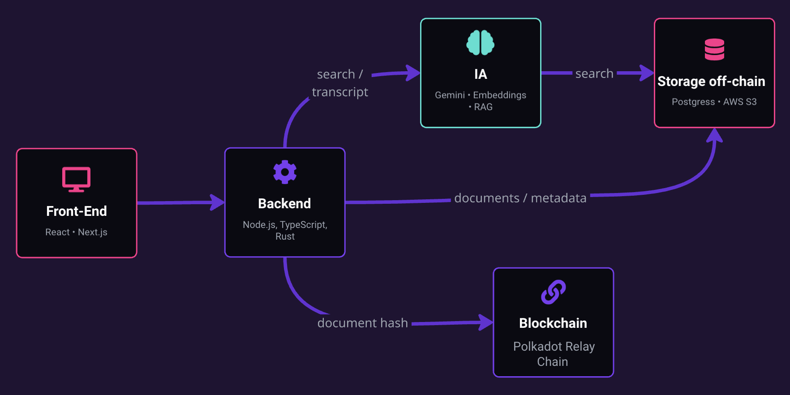
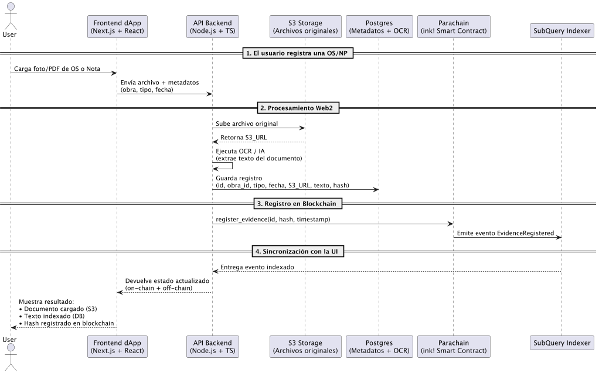

# 💡 IDEA-TON

## Contenido
- [Project Overview](#project-overview)
- [Team Members](#team-members)
- [Pitch Video](https://www.youtube.com/watch?v=1oGsoYutw24)
- [Pitch Deck](https://docs.google.com/presentation/d/1RyJv-ST3eSlvFXZlR7SOaVAwotoWy2GKRQ9r5jj8THw/edit?usp=sharing)
- [Milestone 2 Plan](MILESTONE-2-PLAN.md)
- [Technical Architecture](#technical-architecture)
  - [System Diagram](#system-diagram)
  - [Tech Stack](#tech-stack)
  - [How Data Flows](#how-data-flows)
- [Design And User Flow](#design-and-user-flow)
  - [Mockups](#mockups)
  - [Main User Flow](#main-user-flow)
- [Technical Feasibility](#technical-feasibility)
- [Bonus Material](#bonus-material)
  - [Demo](#demo)
  - [User Feedback / Validation Evidence](#user-feedback)

## **Project Overview**
ObraClara is a digital platform designed to modernize the management of Service Orders (OS) and Request Notes (NP) in public construction projects.

Today, these processes rely on WhatsApp messages, scattered PDFs, and physical logbooks, leading to loss of traceability, legal risks, delays, and low operational transparency.

The platform centralizes the registration, tracking, and validation of critical project documents.

### It incorporates:
- Automated digitalization of OS/NP through uploads of photos, PDFs, text, or voice.
- Immutable blockchain traceability, storing document hashes to guarantee authenticity and prevent tampering.
- Automated alerts for deadlines and critical response windows.
- AI-powered search, enabling users to find historical records, justify delays, audit processes, or generate reports in seconds.
- A unified dashboard for site managers and construction company owners.

ObraClara reduces operational time, eliminates document loss, strengthens transparency, and provides reliable legal evidence for audits and public oversight. It is a scalable solution for construction companies and municipalities, aligned with modern standards of public and private sector management.

---
## Team Members

### Omar [ LinkedIn](https://www.linkedin.com/in/omar-s-moreno/)
**Co-founder · Software Engineer · Backend Developer**

_Experience in building technology solutions, process automation, agile methodologies, user experience, and digital product development._

- **Role:** Designed the technical architecture of the MVP (database integration, AI, notifications, and blockchain).
- **Key Contribution:** Led the technical implementation, validated feasibility, and ensured the scalability of the solution.

### Paulo [ LinkedIn](https://www.linkedin.com/in/paulino-cartagena-10155362/) 
**Co-founder · Civil Engineer**

_Extensive experience in the construction and public works sector. Deep understanding of real pain points in managing service orders and work notes._

- **Role:** Provide end-user perspective, validate current processes, and propose realistic improvements.
- **Key Contribution:** Ensure the solution solves concrete day-to-day problems in public works and support adoption among companies and municipalities.

### Analia [ LinkedIn](https://www.linkedin.com/in/analia-cartagena/)
**Co-founder · Software Engineering · MBA**

_Leads innovation and digital transformation strategy. Experience in project management, agile methodologies, user experience, and digital product development._

- **Role:** Ensure the solution addresses real user needs and aligns with the goals of the competition and of municipalities/contractors.

- **Key Contribution:** Team coordination, survey design, results analysis, and implementation strategy.

---
### Pitch Video
TODO!!
(https://youtu.be/1oGsoYutw24)
- [ ]  2-3 minute pitch video (uploaded and link provided)
    - Walkthrough of what you built + your pitch
    - Include: problem, solution, demo, market context, Milestone 2 overview
    - Upload to any platform (e.g., YouTube, Loom) and share the link
---
TODO!!
### [Pitch Deck](https://docs.google.com/presentation/d/1RyJv-ST3eSlvFXZlR7SOaVAwotoWy2GKRQ9r5jj8THw/edit?usp=sharing)
- [ ]  Pitch deck (URL)
    - Problem & solution
    - Market research & competitive analysis
    - Technical approach
    - Milestone 2 plan summary

---
## Technical Architecture
### System Diagram

### Tech Stack

**Frontend:**
- Framework: Next.js + React
- Web3: polkadot.js
- UI: TailwindCSS

**Backend / Contracts**
- Type: API service 
- Language: (Node.js / TypeScript)

**Storage:**
- S3 (archivos OS/NP)
- Postgres (metadatos + IDs + texto transcripto + usuarios + obras)
- On-chain: ID del documento + hash SHA-256 (integridad inmutable)

**AI / OCR:**
- Google Gemini
- OpenAI API (para fallback)
- Extracción/normalización de texto para búsquedas rápidas

**Blockchain:**
- Chain: Parachain Paseo Testnet con soporte ink!
- Tools: 
  - SubQuery (indexación de eventos registrados en blockchain)
  - polkadot.js API (interacción backend → parachain)

### How Data Flows

## Mockups showing user flow
**Wireframes/mockups showing user flow** 
Esta seccion muestra el flujo que sigue el usuario al utilizar la plataforma
